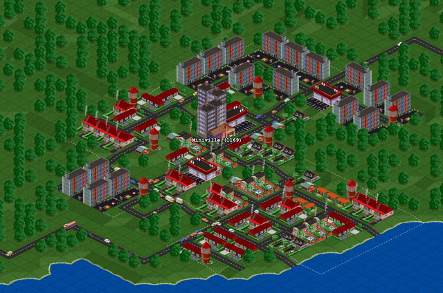

# Isometrica

This is JavaScript city building game prototype I've built around 2012.
In 2026 I've added more features and vehicles.
Keeping it alive for historical reference only.

### Live demo
https://nrshvch.github.io/isometrica

### Features

* Procedurally generated, endless world
* Minimalistic hand-rolled canvas2d game engine

### How to run
* Install dependencies
> npm install

* Start a local dev server and open the game
> npm start

This runs Vite, rooted at `app/`, with the game served at `/`.

* Build an optimized bundle into `/dist`
> npm run build

* Preview the production build locally
> npm run preview
