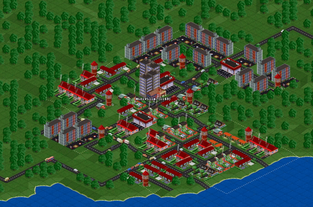

# Isometrica

This is JavaScript city building game prototype I've built around 2012.
In 2026 I've added more features and vehicles.
Keeping it alive for historical reference only.

### Live demo

https://peeps.land

### Features

- Procedurally generated, endless world
- Minimalistic hand-rolled canvas2d game engine

### How to run

- Install dependencies

> npm install

- Start a local dev server and open the game

> npm start

This runs Vite, rooted at `app/`, with the game served at `/`.

- Build an optimized bundle into `/dist`

> npm run build

- Preview the production build locally

> npm run preview

### Sprites

- Hand-drawn pictures live in `assets/sprites`, named by their path there
  (`buildings/shop.png`). `npm run build:sprites` (run before `start`, `dev`
  and `build`) packs them into `src/public/gfx`, grouping related pictures
  onto shared sheets, and writes `gfx/manifest.json` with every sprite's size.
  After changing a picture while the dev server runs, run it again.
- The ground, the cars and the stones are painted by the game itself
  (`src/shared/gen`), one picture at a time, the first time something draws
  it, in a web worker (`src/client/js/generator.js`). At build time each
  generator describes what it will paint - every picture's name and size,
  and data such as car pivots - into `gfx/generated/<generator>.json`, so
  the game knows every sprite's size before it is painted. Nothing painted
  is kept between visits: painting a picture takes a few milliseconds, so
  each visit paints just what it draws.
- What is on screen is drawn from a few big canvas pages
  (`src/client/js/canvascache.js`), not from the sheets: a sprite is copied
  there the first time it is drawn, and whatever has gone undrawn longest
  makes room when the pages are full. Something made of several pictures,
  like a shore tile, is put together there once
  (`sprites.getComposite([...])`); something that changes every frame, like
  a police car's lamp, is drawn over it as a sprite of its own.
- Blocks of flats and offices are put together out of parts the game
  paints - ground storey, upper storeys, roof, yard - in a style each
  (`src/shared/gen/flats.js`, `offices.js`) on what all blocks share
  (`src/shared/gen/blocks.js`). Each block picks its colours and details at
  random when it is first drawn and keeps the parts it is made of in the
  save (`src/client/js/compoundbuilding.js`); the catalogue shows one of
  each kind (`src/data/flats.js`, `offices.js`).
- Shops are painted the same way (`src/shared/gen/shops.js`), but one
  catalogue entry per footprint (`src/data/shops.js`) stands for several
  designs: a 1x1 corner shop (flat, gable or shed roof, a firm's striped
  awning or none, fascia or side board), a 1x2 shop with a car park, a 2x2 superstore and a
  2x3 shopping centre or covered market, the big ones with a pole sign.
  Which design, colours and details a shop gets is picked when it is
  placed, so the ghost already shows what will be built. Car parks - the
  shops' and the blocks' - are filled with cars from the vehicle
  generator, different for every building.
- Houses are painted the same way (`src/shared/gen/houses.js`), one
  catalogue entry per kind and footprint (`src/data/houses.js`): village
  houses that need no road or water - a cottage on 1x1 with hens, a cow, an
  orchard or a well, a farmstead on 1x2 with a barn, a field or sheep;
  town houses with hedges or picket fences - a bungalow with its garage on
  2x1, a two-storey house end on to the street on 1x2 and 1x3;
  semi-detached houses on 2x2, and on 2x3 end on to the street with a back
  garden behind each half, each half with its own parking space and gate; and villas on 2x2 and 3x2 behind a
  gate in a high hedge or a wall, with a fountain or a pool. Houses are
  built to the scale of the cars and roads - a car is about 4.5 m long, so
  a tile is about 10 m across and a storey 12 high - and what does not fit
  a footprint is left to a bigger one: the bungalow has a drive to its
  garage but no room to park on it; the two-storey houses on two and three
  tiles take the whole width of their plot, the car on a hard standing in
  the front garden, and keep their back gardens to themselves, out of their
  back doors. Smoke rises from the chimneys of every
  house lived in. Whatever of a house stands in front of the cars on its
  drive is drawn again over them, so a car behind a hedge stays behind it
  whichever way the house is turned - and the front of a building site's
  fence over its digger and lorry the same way.
- The water tower is painted too (`src/shared/gen/utilities.js`), in one
  of four European designs picked when it is placed: a concrete bowl on a
  shaft banded red and white, a slim steel tank on a steel column with a
  ladder up it, a square shaft of precast panels with three lens-shaped
  tanks stacked up its side, or a brick shaft with a wider tank of steel
  sheet on it. Each has a colour of its own and a band of blue round its
  tank; whatever is round is laid out in columns a unit across, so it keeps
  to the pixels like everything else.
- Parks are painted too (`src/shared/gen/parks.js`), one catalogue entry
  per footprint (`src/data/parks.js`) - 1x1, 1x2, 1x3, 2x2 and 2x3 - each
  laid out as one of three kinds picked when it is placed: a sports park of
  courts and a skate spot (basketball, half a court on one tile, tennis on
  three, ramps, a box and a rail) inside a wire fence; a formal garden on a
  pattern of paved walks, a fountain where they cross and beds edged with
  box, of flowers or lawn with small trees; or a town park of gravel walks
  winding between trees, benches, bins and lamps, with a big fountain or a
  pond on the bigger footprints. A park needs no road or water and earns
  nothing; the town pays its upkeep.
- The catalogue opens with what a game starts with - what needs neither a
  road nor water, the houses and the water tower first, then the parks -
  and then everything else, the cheaper first.
- A tap on nothing - bare ground, a road, the sea - while nothing is being
  looked at puts away the words over the world ("no jobs", how far along
  one going up is, the city's name): the town on its own, for a picture of
  it. They stay away while the camera is dragged, zoomed or turned, and come
  back with the next tap on nothing - or with anything else: a tap on a
  building, placing or shaping the ground, a press on any button.
- Shaping the ground starts on the building that was being looked at, if
  any - its tiles picked rather than the one in the middle of the screen -
  and a building tapped while shaping picks the tiles it stands on.
- A few firms turn up all over town (`src/shared/gen/brands.js`): bolt the
  builders' merchant, orchard the grocer, pillar the bank, blaze the burger
  bar and amber the brewery. Each has its colours and an emblem - hazard
  stripes; stripes leaning forward and a round fruit; three columns; a bun;
  the sun going down over the sea - on the small shops' fascias, boards and
  awnings, the stores and superstores, the pole signs in their car parks,
  the billboards on the offices and the sides of delivery trucks and vans.
  Nothing anywhere has letters on it: at a pixel or two high they read as
  noise.
- Roads are painted too (`src/shared/gen/roads.js`): a piece for every way
  a tile joins up with its neighbours and a ramp for every slope, each
  plain - asphalt with a dashed line and gravel edges - or paved, with
  kerbs, pavements and zebra crossings over junctions, and street lights
  along it. A road is paved where it is part of the city's road network
  and has a building next to it (`src/client/js/roadman.js` paved); out in
  the country, or on a stretch that does not join the network, it stays
  plain, and it changes back and forth as buildings go up and come down.
- The catalogue offers only what is painted: the hand-drawn houses, shops,
  offices, flats, town hall, trees and cliff are kept for the cities that
  already have them, but no longer offered.
- The ground is painted from nothing (`src/shared/gen/terrain.js`): grass
  with lusher clumps, drier patches, blades, clover and the odd flower;
  water with its swell and ripples catching the light - the shallows along
  the shore and deep water further out, alike but for their blues, deep
  water spilling over the edges of the shallows next to it in a ragged,
  dithered contour (the terrain generator's diffuse tiles);
  and every tile's outline is its corners joined up, lit by the same sun as
  the buildings. The grid is not painted into the tiles but laid over them,
  see-through black round every tile, as the tiles drawn by hand had it. A
  shore tile has the water come a little way up it, then wet sand, sand and
  the grass, each line ragged with a grain of pixels along it the way deep
  water's edge over the shallows is - by how high the ground is, so a shore
  runs on unbroken from tile to tile.
- A building goes up on uneven ground the way it did in Transport Tycoon:
  level at the highest corner under it, on a concrete base cut to the
  ground (`src/shared/gen/foundations.js`, `BuildingView` addFoundations) -
  as long as the ground falls no more than a step anywhere under it
  (`src/core/buildings.js`). The base is picked as the tile is seen, so it
  turns with the camera. On the shore, where the water is painted a little
  way up the ground and so looks higher, the base is the same, marked where
  the water stands against it: wet and darker below that waterline, a line
  of weed along it and a tide mark above. A road on the shore is always
  levelled at the top on such a base - never laid on the sand as it is.
- On a slope that rises a step at most a road is laid the way OpenTTD lays
  its roads (`src/client/js/road.js` Road.decide, `roadview.js` addBase): up
  a smooth slope as a ramp, or across it levelled at the top on a concrete
  base - a T where a road goes on up the slope from it; where only one
  corner of the ground is up, a ramp on a concrete wedge that climbs the
  step from a road at its foot; anywhere else levelled at the top. A new
  road on flat ground next to a road on concrete a step above it is a ramp
  up to it on concrete of its own, so a levelled road can always be reached
  from below. How a
  road on a slope is laid is decided as it goes down, by the way the run
  the player drags goes through it - a run across a slope is levelled all
  along, whatever roads come up to it from above or below; a run up it is a
  ramp; a road put down on its own is laid the only way it can be, up the
  slope - and kept with it in the save, the city's roads in the order they
  were built (Road.lay, Road.planned). The road that came first stays as it
  is, and a road that does not fit it is still laid, but does not join it -
  as in OpenTTD, but without turning the new one down. Roads in a save from
  before this, the starting city's too (`src/data/initialcity.js`), are laid
  for good as they were drawn. Which way roads join is worked out from the
  roads next to them every time; where either is on concrete, only where
  the two meet at the same height, so there is no crossroad over a step,
  and cars do not drive over one. The preview of a road being laid shows
  it and its neighbours exactly as they will be laid.
- Land can be raised and lowered under buildings and roads, the way
  OpenTTD shapes land under its foundations (`src/core/city.js` stays,
  `src/client/js/road.js` fitTo): whatever stands there keeps the height it
  is at, and the concrete under it takes up the difference - ground raised
  to the top of a base replaces it, ground taken down from under a building
  or a road leaves it on a base, a whole step over flat ground if need be,
  kept in the save (core/building base, a road's look top). Anything that
  would have to move up, sink more than a step below it, or end up in the
  water, or a road on the shore other than levelled, is still in the way.
- The trees are painted too (`src/shared/gen/trees.js`), as pixel art: each
  kind's own shape - oak, beech, ash and alder, two of each - filled in with
  three flat greens and lit by the buildings' sun, every tone in patches
  rather than speckled - each painted from its four sides, so turning the
  camera shows another side of it, and a tree stands whichever way round
  its tile has it. The world grows each kind in stands
  (`src/core/ambient.js`); the two trees drawn by hand are the first oak and
  beech now, so cities that had them keep their trees.
- A town starts without a town hall. Its name hangs over the middle of the
  land it owns, and its road network is the biggest stretch of its roads
  that hangs together - a building is on the road when it is next to that;
  a lane off on its own does not count. With no town hall to bill it to,
  the land is billed by the city itself.
- The backs of buildings are not left bare (`src/shared/gen/blocks.js`
  backs): a shop has a steel door out to its bins - and a skip, behind a
  big one - the air conditioning's units on the wall, rain streaks, the odd
  tag sprayed on it and a wire fence round its service yard; blocks of
  flats have their bins out at the back and units on their end walls.
- While a selection is dragged about, the buildings in it keep the looks
  they were shown with; only a selection of another size picks again.
- Every building goes up on a building site - the same parts for all of
  them (`src/shared/gen/sites.js`): bare earth, and on each tile one of an
  excavator, a lorry, a heap of sand, the site office or a tower crane,
  dealt out for each building (`src/shared/gen/stacking.js`), and a blue
  tarp fence round it all. A small building's site - a park, a cottage or
  farm of the village, a house or shop on one tile - has no crane and a low
  timber rail round it instead (`client/compoundbuilding.js` smallSite). A
  block of
  flats or offices then grows its own structure from a quarter of the way,
  and its lower storeys finish under it from halfway; the crane, stacked
  out of steel lattice mast sections that shade each other, grows with it. The excavator drives, stops and turns
  to dig, and the crane's jib swings to and fro
  (`src/client/js/siterenderer.js`); the lorry and the excavator are the
  vehicle generator's, and the excavator never drives the streets.
- Any building can be turned four ways (`src/core/rotation.js`). Blocks are
  painted from all four sides; a building drawn by hand shows its front for
  its back and its side for the other side.
- The camera turns round the city a quarter turn at a time: two fingers
  twisted on a touch screen or trackpad, or Q and E. Nothing in the world
  moves - the engine's camera turns about the up axis, and draws things in
  the order it sees them in (`CameraComponent#depthAxes`). What changes is
  which picture each thing shows: `src/client/js/view.js` says how the
  world looks from the side the camera is on, and the ground, roads,
  buildings, trees and cars each pick their picture by it - a tile's slope
  by its corners as seen, a building turned as many more times as the
  camera is, drawn from the tile of it nearest the camera's own corner.
  It turns at any time, in the middle of placing a building or shaping the
  ground too: what is being placed is drawn again from the new side.
- The city a new player starts on (`src/data/initialcity.js`) is built
  entirely of generated buildings - houses, blocks of flats with their
  yards, office blocks, shops and superstores - each turned to face the
  street it stands on.
- Whatever is painted out of boxes - buildings, roads, vehicles - keeps to
  the pixels the way a picture drawn by hand does (`src/shared/gen/isobox.js`
  snap): every box is snapped to whole units before it is painted, so an
  edge along the ground is a clean step of two pixels across for one down
  and a stripe a unit wide a line a pixel thick, never one that is two
  pixels thick here, one there and broken into dots elsewhere. What is
  thinner than half a unit - a road marking, a pane of glass - is laid flat
  on what it is on; a pole or a rail is made a unit thick. Roofs and ramps
  are planes the boxes are cut by, not staircases of thin strips, and roofs
  are pitched half a unit up for one across, so their gable ends come out
  clean diagonals.
- Surfaces are made of something rather than speckled at random
  (`isobox.js` MATERIALS), laid out a pixel at a time and lined up with the
  tiles and storeys: brick courses, stone, siding and logs on the houses,
  precast panels on the flats, tiles, slates and thatch on pitched roofs,
  felt on flat ones, steel sheet on the superstores, asphalt, paving slabs,
  gravel, grass, sand and bare earth on the ground. A colour can be made of
  a material wherever it is used (`blocks.js` madeOf).
- To look at what the painting makes without starting the game, run
  `npm run generate:terrain`, `generate:vehicles`, `generate:stones` or
  `generate:buildings`. They
  run the same code the game does and write pictures to `assets/terrain/terraingen`
  and `assets/previews` (not committed).
